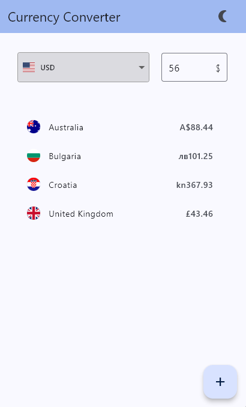

# Currency Converter

A cross-platform Flutter app that helps you convert one currency to another using real-time exchange rates. This app supports Android, iOS, Web, and Windows platforms, providing an easy-to-use and responsive UI.

## Features

- **Currency Conversion**: Converts currencies based on exchange rates, which are updated daily.
- **Cross-Platform Support**: Works seamlessly on Android, iOS, Web, and Windows platforms.
- **Responsive Design**: The app is optimized for mobile, tablet, and desktop devices.
- **User-Friendly Interface**: A simple and intuitive UI that facilitates easy currency conversion.
- **Light and Dark Mode**: The app supports both light and dark modes for better user experience.
- **Multi-Currency Conversion**: Users can convert multiple currencies at the same time.
- **Modular Structure**: Each component is separated into its own file for better maintainability.

## Screenshots

Here are some images showing the project in action:

  
_Home Screen_

  
_Modal to select currencies that need to be converted_

  
_Multiple Conversions_

  
_Currency Dropdown Choices_

  
_light mode_

## Getting Started

Follow these steps to get the project up and running on your local machine.

### 1. Clone the repository

Start by cloning the repository:

```bash
git clone https://github.com/May-Hemade/currency_converter.git
```

### 2. Install dependencies

Navigate into the project directory and install the necessary dependencies using Flutter's package manager:

```bash
flutter pub get
```

### 3. Set up the API Key

You will need your own API Key from [Free Currency API](https://freecurrencyapi.com/) to fetch exchange rates. After signing up, copy your API key and create a .env file in the root of the project with the following content:

```
FREECURRENCY_API_KEY=your-api-key-here
```

### 4.Run the application

You can run the application on different platforms:

```bash
flutter run
```

## Acknowledgments

- **Flutter**: For providing an amazing cross-platform framework that powers this app.
- **API Provider**: Free Currency API from [freecurrencyapi.com](https://freecurrencyapi.com/) for real-time currency exchange rates.
- **Material Design**: For providing design guidelines that ensure consistency and great user experience across platforms.
